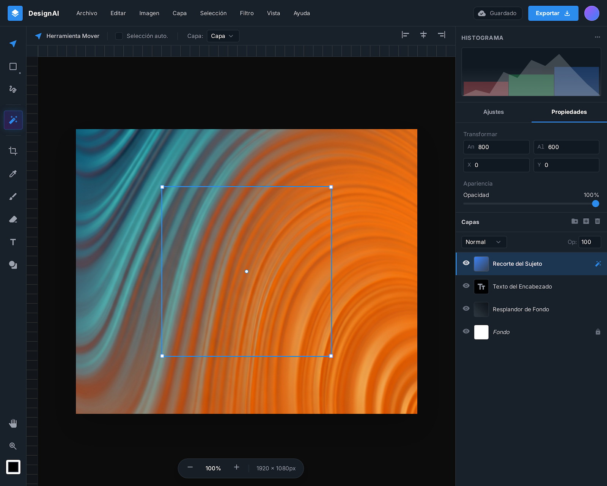
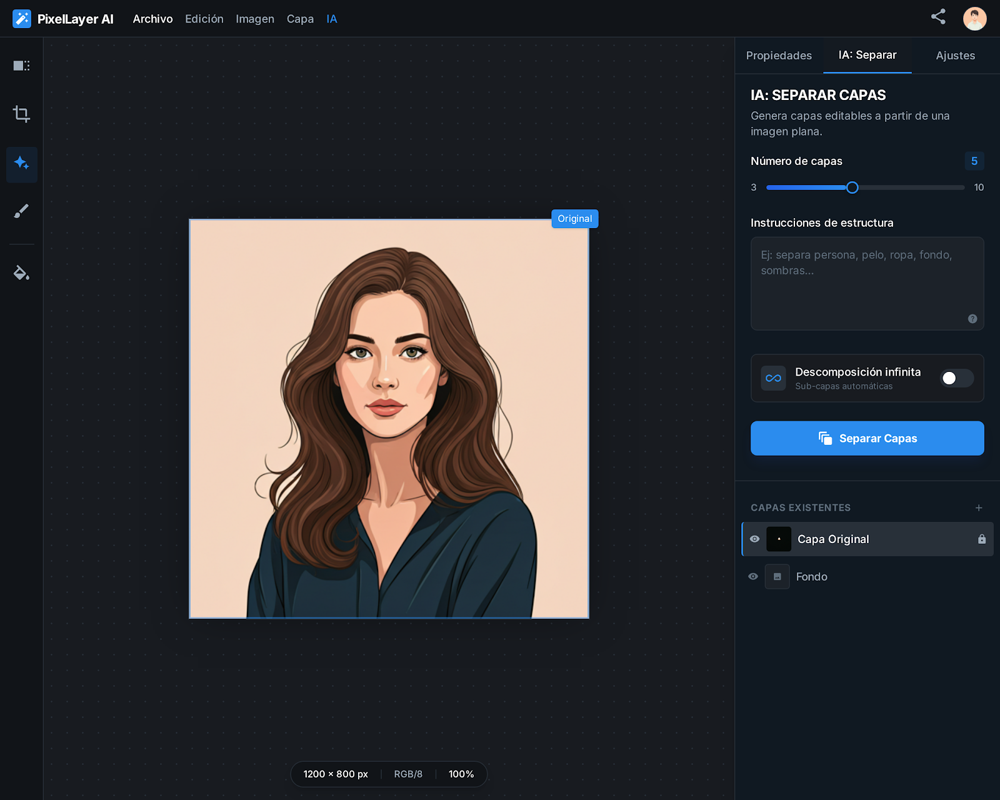
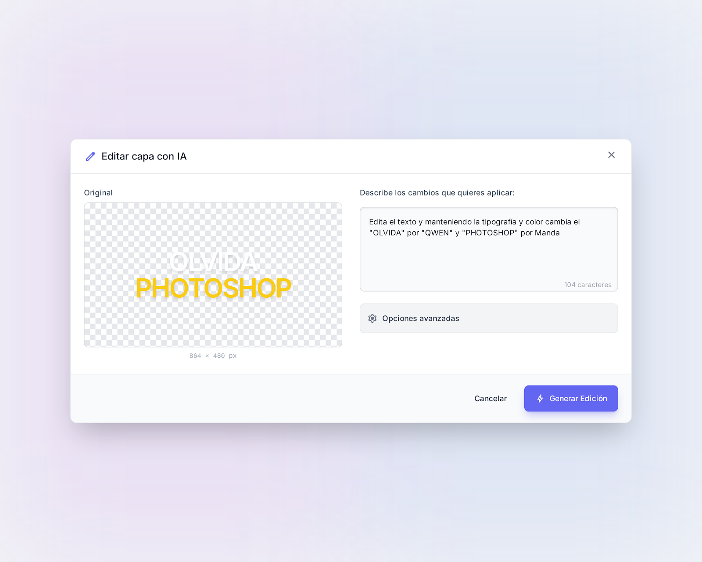

# PhotoClone - Editor de Imágenes Web

Editor de imágenes estilo Photoshop construido con Next.js 15, React 19 y Canvas API. Incluye integración con IA para separación automática de capas.



## Características

- **Editor Profesional**: Interfaz de 4 zonas (TopBar, Toolbar, Canvas, RightPanel)
- **Sistema de Capas**: Visibilidad, opacidad, modos de mezcla, grupos
- **10 Herramientas**: Pincel, Borrador, Mover, Cuentagotas, Texto, Selección, Zoom, Mano, Recortar, Lazo
- **IA Integrada**: Separación automática de imágenes en capas (Replicate API)
- **Edición de Capas con IA**: Modifica capas existentes usando prompts de texto
- **Exportación**: PNG, ZIP con capas, formato proyecto .photoclone
- **Atajos de Teclado**: V, B, E, T, Z, Ctrl+Z/Y, etc.
- **Autenticación**: Supabase (Email, Google, GitHub)

## Stack Tecnológico

- **Framework**: Next.js 15.5.9
- **UI**: React 19, Tailwind CSS
- **Estado**: Zustand
- **Canvas**: Canvas 2D API
- **Auth**: Supabase
- **IA**: Replicate (qwen/qwen-image-layered)
- **Export**: JSZip, FileSaver

## Requisitos

- Node.js 18+
- npm o yarn
- Cuenta Supabase (para autenticación)
- API Key de Replicate (para IA)

## Instalación

```bash
# Clonar repositorio
git clone https://github.com/bladealex9848/Clon_Photoshop.git
cd Clon_Photoshop

# Instalar dependencias
npm install

# Configurar variables de entorno
cp .env.example .env.local
# Editar .env.local con tus credenciales
```

## Variables de Entorno

```env
# Supabase
NEXT_PUBLIC_SUPABASE_URL=tu_supabase_url
NEXT_PUBLIC_SUPABASE_ANON_KEY=tu_supabase_anon_key

# Replicate (IA)
REPLICATE_API_TOKEN=tu_replicate_token
```

## Desarrollo

```bash
# Servidor de desarrollo
npm run dev

# Build de producción
npm run build

# Iniciar producción
npm start

# Linting
npm run lint
```

## Estructura del Proyecto

```
src/
├── app/                    # Páginas Next.js App Router
│   ├── page.tsx           # Landing page
│   ├── editor/            # Editor principal
│   ├── login/             # Autenticación
│   ├── register/          # Registro
│   ├── callback/          # OAuth callback
│   └── api/               # API Routes
├── components/            # Componentes React
│   └── editor/
│       ├── TopBar/        # Barra superior con menús
│       ├── Toolbar/       # Herramientas lateral
│       ├── Canvas/        # Área de dibujo
│       └── RightPanel/    # Panel derecho (capas, IA)
├── stores/                # Estado Zustand
│   ├── useLayerStore.ts   # Gestión de capas
│   ├── useToolStore.ts    # Herramienta activa
│   ├── useViewStore.ts    # Zoom, pan, guías
│   ├── useHistoryStore.ts # Undo/redo
│   └── useAIStore.ts      # Estado IA
├── lib/                   # Utilidades
│   ├── canvas/            # Motor de renderizado
│   ├── tools/             # Implementación herramientas
│   ├── export/            # Exportadores
│   └── supabase/          # Cliente auth
├── types/                 # TypeScript interfaces
├── constants/             # Constantes
└── hooks/                 # Custom hooks
```

## Atajos de Teclado

| Atajo | Acción |
|-------|--------|
| V | Mover |
| M | Selección rectangular |
| L | Lazo |
| B | Pincel |
| E | Borrador |
| T | Texto |
| I | Cuentagotas |
| C | Recortar |
| Z | Zoom |
| H | Mano (pan) |
| Ctrl+Z | Deshacer |
| Ctrl+Shift+Z | Rehacer |
| Ctrl+S | Guardar proyecto |
| Ctrl+E | Exportar PNG |
| Ctrl++ | Acercar |
| Ctrl+- | Alejar |
| Ctrl+0 | Ajustar a pantalla |

## API de IA

El endpoint `/api/layers/decompose` utiliza el modelo `qwen/qwen-image-layered` de Replicate para separar imágenes en capas automáticamente.



## Edición de Capas con IA

El panel de capas incluye un botón de edición IA (icono `auto_fix_high`) que permite modificar capas existentes usando el modelo `qwen/qwen-image-edit`:



```typescript
// Ejemplo de uso
const response = await fetch('/api/layers/decompose', {
  method: 'POST',
  headers: { 'Content-Type': 'application/json' },
  body: JSON.stringify({
    imageUrl: 'https://example.com/image.jpg',
    layerCount: 4,
    instructions: 'Separar fondo, personaje, objetos'
  })
});
```

## Licencia

MIT License - ver [LICENSE](LICENSE) para detalles.

## Contribuir

1. Fork del repositorio
2. Crear rama feature (`git checkout -b feature/nueva-funcionalidad`)
3. Commit cambios (`git commit -m 'Agregar nueva funcionalidad'`)
4. Push a la rama (`git push origin feature/nueva-funcionalidad`)
5. Crear Pull Request
